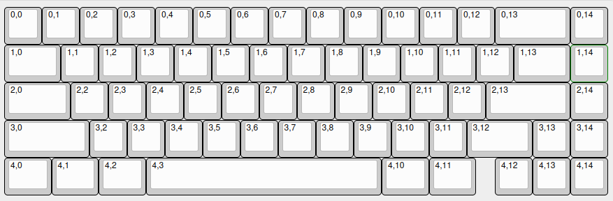
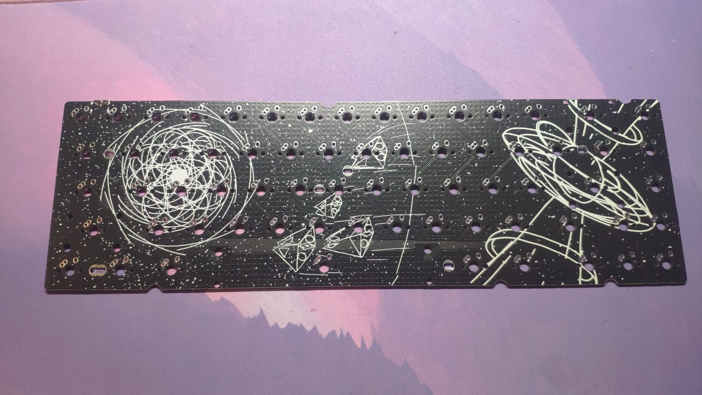
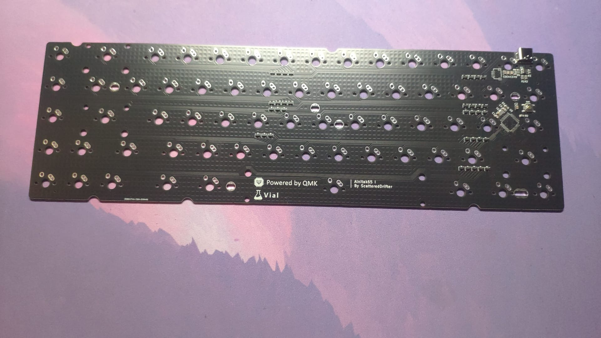

# Alnitak-65

typical plain-c with the twist of supporting Alps and a weird 8u, flipped Iso-Enter layout

The outlines and mounting hole positions were taken from the [bakeneko60](https://github.com/kkatano/bakeneko-65)

---

### Current Status:

- Prototypes arrived; fully tested and working 

- tray mount / bakeneko65 case compatible 

---

## Alnitak-65:

the largest keyboard among my three-board-series named after the three bright stars forming the omnipresent orion belt you can perceive within the night.

Its the typical 65% keyboard with a blocker and separated arrow-keys within the bottom-row but it supports ALPS-Switches. Thats they biggest point to distinguished the board from other designs.

If you wish to order your own pcb and case, you can find all the necessary files within this repository 

---

## Features:

- one layout option:

- pcb-outlines support the use of a bakeneko65 case

- jst-connector implemented, supporting the use of the unified daughterboard **C3** 

- mounting holes for typical tray-mount cases **not tested yet**

- Supports both alps and mx-style switches 

---

## Images:

